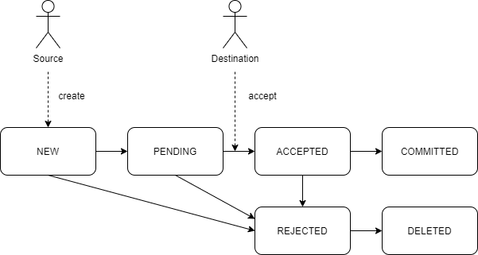
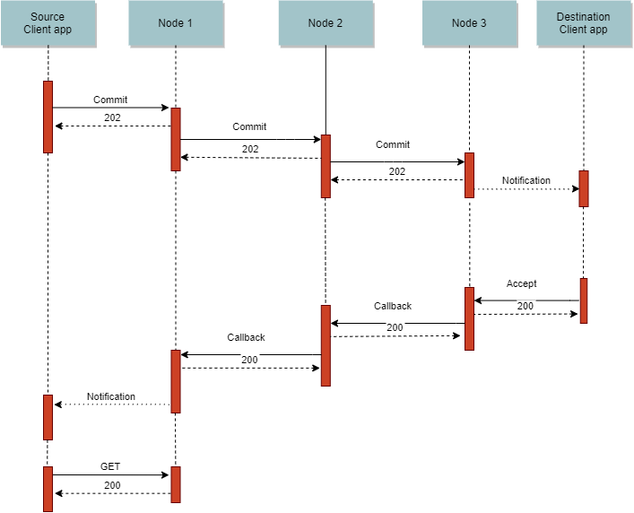

# Accounting protocol

Interoperable Accounting for Exchange Communities

**This is a work in progress document**. Feedback welcome at komunitinbox@gmail.com or at [GitHub](https://github.com/komunitin/komunitin-api).

## Introduction
The Accounting API defines a protocol to make payments and charges between members of exchange communities. It can be used for simple local transaction between members of the same exchange group but it also defines a way to make payments across different exchange groups, exchanging the currencies. That makes the protocol very powerful and different from most other options out there.

The protocol is simple to implement and understand: just a regular JSON RESTful API following the [JSON:API](https://jsonapi.org) guidelines. It is also not tight to any technology. It makes use of standard cryptography techniques to make the protocol secure and minimize the trust the members must have with the system. Concretely, members only have to trust their local exchange groups. Local exchange groups must only trust their local neighbours (the currencies they are directly connected to). The system allows then transactions with remote currencies making several currency exchanges from the origin to the destination.

The protocol does not use a shared ledger and it doesn't use any global consensus mechanism. That allows infinite scalability and also it allows a high level of privacy even for transactions with remote exchange groups.

It is designed specifically for community exchange groups. It does not use the concept of external market makers to exchange between different currencies. The exchange groups themselves enable gateways that connect their currencies only with their neighbour currencies (one of them is enough) or with one clearing central at the exchange rate they choose. Exchange groups must actively take care of their balance trades with their directly connected currencies for the health of their own currency, trying to keep it close to zero. In a simple setting with only one connection to a remote currency, that means that the total amount bought outside the exchange group must be roughly equal than the total amount sold outside the group.

## Objects
These are the different resource objects in the API.

### Currency
Defines a currency. The 4-letter codes used in CES (https://community-exchange.org) and IntegralCES (https://integralces.net) are of `CEN` type. Other types of codes may be defined. 

The `scale` is the integer such that `10^(-scale)` is the minimal division for that currency. Currency amounts are specified in this API as integer multiples of `10^(-scale)` minimal unit. `decimals` is the number of decimal digits that should be usually presented to the user.

The `value` is important field for exchanging with other currencies. It defines the value of that currency against a global virtual value that is defined to be an average basic human hour of labor divided by 10^6. So, if the value of currency is exactly on hour of labour (for timebanks, for example), the value field will be 10^6. If the value of a currency is paired to, for example, the Euro, then the value field will be around 10^5. In practice, once the first currency has set their `value` field, new currencies are setting their value compared to previous currencies.

```JSON
{
    "type": "currencies",
    "id": "XXXX",
    "attributes": {
        "code-type": "CEN",
        "code": "WDLD",
        
        "name": "wonder",
        "name-plural": "wonders",
        "symbol": "₩",
        "decimals": 2,
        
        "scale": 4,
        "value": 100000,
    }
}
```
### Account
An account holds a balance of a specific currency and is the source or destination of money transfers.

The credit limit is the maximum balance the account may have, and the debit limit the minimum negative balance. A negative value means no limit. These limits are set by the exchange group administration.

`capabilities` are the operations allowed from this account. They are:
 - `pay`: The account may initiate payments.
 - `charge`: The account may initiate charges.
 - `connector`: The account may act as a *direct connector* for extern payments.
 - `rippling`: The account may act as a *rippling connector* for extern payments.

The key may or may not be unique for the account. In centralized systems where all accounts are managed by a single server, all accounts may share the same cryptographic key.

```JSON
{
    "type": "accounts",
    "id": "XXXX",
    "attributes": {
        "code": "Alice",
        "balance": 3200000,
        "locked": 0,
        "credit-limit": -1,
        "debit-limit": 5000000,
        "capabilities": ["pay", "charge"],
    },
    "relationships": {
        "currency": {
            "links": {
                "related": "https://komunitin.org/WDLD/currency"
            }
        },
        "keys": [
            {"data": {"id": "xyz", "type": "RSA2048"}}
        ]
    },
    "links": {
        "self": "https://komunitin.org/WDLD/accounts/Alice"
    }
}
```
### Transfer
A transfer is a plain JSON object defining a movement of certain amount of credit from one account to another.

```JSON
{
    "payer": "https://komunitin.org/WDLD/accounts/WDLD0002",
    "payee": "https://komunitin.org/WDLD/accounts/WDLD0003",
    "amount": 200000,
    "meta": "10 kg of potatoes"
}
```
#### Meta
The meta field may be used to carry any information related to the transfer. In its simplest form, it is just a plain string with a description of the transfer.

If not a string, then the `meta` field is an object with a field `type` that identifies the scheme of the meta object.

The protocol may be extended with different types for the meta field, including encrypted content for better privacy. That will be relevant for extern transfers.

### Transaction
A transaction is the unit of change in the Accounting API. A transaction contains typically just one transfer, but servers may add additional transfers in a transaction to implement features such as taxes. All transfers in a transaction will be committed all or none atomically, and in the specified order.

A transaction may be in different states: 
 - `new`: The transaction has been created and passed the automatic validations.
 - `pending`: The transaction is awaiting acceptance by at least one party.
 - `accepted`: The transaction is accepted by all parties and ready to be committed. The server should lock the resources from accounts so the transaction can actually be committed.
 - `committed`: The transaction has already been committed. Once a transaction is committed, it can't be undone.  
 - `rejected`: The transaction has been rejected by one of the parties and won't be committed.

 The `expires` field has different meanings depending on the transaction state. For a `new` transaction, it means the time where it may be automatically deleted. For a `pending` trnsaction, the maximum time it should be `accepted`or `rejected` before automatic behavior (which may be automatic rejection or acceptance). For an `accepted` transaction, the maximum time where it should be committed. 

```JSON
{
    "data": {
        "id": "uuid2",
        "type": "transactions",
        "attributes": {
            "transfers": [{
                "payer": "https://komunitin.org/WDLD/accounts/WDLD0002",
                "payee": "https://komunitin.org/WDLD/accounts/WDLD0003",
                "amount": 200000,
                "meta": "10 kg of potatoes"
            }],
            "state": "new",
            "created": "2020-08-19T23:15:30.000Z",
            "updated": "2020-08-19T23:15:30.000Z",
            "expires": "2020-08-19T23:20:30.000Z",
        },
        "relationships": {
            "currency": {
                "links": {
                    "related": "https://xchange.net"
                }
            }
        },
        "links": {
            "self": "https://xchange.net/transactions/uuid2
        }
    }
}
```

### Extern transfers

Extern transfers define a movement of amount from one account in one currency from another account in another currency, eventually managed by a remote server.

```JSON
{
    "payer": "https://wonderland.org/alice",
    "payee": "https://reggaex.org/bob",
    "amount": 20000,
    "meta": "10 kg of potatoes",
    "local-payer": "https://xchange.net/wonder",
    "local-payee": "https://xchange.net/reggaex",
    "payer-signature": "alice's",
    "payee-signature": "bob's"
}
```
Beyond regular transfer attributes, they have the `local-payer` and `local-payee`. These are the local accounts that are involved in the extern transfer. They may be ommited if are equal to `payer`or `payee` respectively.

Extern transfers may also carry the cryptographic signature of the payer and the payee.

#### Signature algorithm
In order to build or verify a transfer signature the following string must be created:

```
[payer]:[payee]:[amount]:[meta]:[state]:[date]:[nonce]
```

Where the first 4 elements are the content of the transfer fields, `date` is the transaction `updated` field and `nonce` is a random number also included as a transaction field. Note that the signature includes the state, so a s signature will be used as a proof of acknowledgment of the state of a transaction. 

Encode the string in UTF-8. Then use the private key of the signing account and the cryptographic algorithm specified in the account key and sign the transaction using a standard algorithm. Finally encode the result in BASE64.

In order to avoid replay attacks, servers should persist all transactions for at least one month and reject any signature with repeated nonce and also reject all signatures older than one month. This way a signature can't be reused for a new transaction.

## API
The API follows the [JSON:API](https://jsonapi.org) guidelines.

The common CRUD operations are defined at `currency` and `accounts` endpoints for administrative operations.

Payments and charges are done using the `transactions` endpoint. Tipically a transaction will be created with a `POST` request to the transactions endpoint and later it will be either accepted, committed or rejected by updating the transaction using `PATCH` requests that change the `state` field and eventually the signature fields.

### Transaction workflow
When a valid `POST` request is received at the `transactions` endpoint, the transaction is created with `new` state. That means that the transaction won't be applied by now. This initial state is useful for systems that may add taxes, fees or other features on transactions: the user may create a transaction to see the additional issues to the transaction and later, if they agree with the created transaction, accept and commit it. Depending on account configurations, once the source account has accepted a transaction the destination account may also need to accept the transaction before it can be committed, so the transaction will be meantime in `pending` state. Once all parties have accepted the transaction, it becomes `accepted` state and it is ready to be committed. Once a transaction is `committed`, it can't be deleted, edited nor rejected.



A single transaction doesn't need to pass through all states from `new` to `committed`, but can pass through several states at once.

For example, if a source account wants to pay to another account that is configured to automatically accept payments (as most of them would do), then the source account may directly `POST` a transaction with `committed` state, that will be eventually validated and applied by the server at once. That could be also a charge transaction if the destination account is configured to automatically accept charges or the source account is whitelisted to be automatically accepted.

Suppose now that the destination account is configured to manually accept incomming charges. The source account may `POST` a transaction with state `committed`, but since the destination account doesn't automatically accept the transaction, the response from the server will be a transaction with `pending` state. The destination account will eventually `PATCH` the transaction with `accepted` state. That will accept and immediately commit the transaction.

## Extern payments

### Introduction

This accounting protocol defines how to perform credit transfers between accounts in remote exchange groups, with different currencies, eventually managed from different servers. In order to do so, the protocol makes successive exchanges from the *source account* to the *destination account* through a chain of connections. A *connection* between two currencies is a pair of accounts, one in each currency and each one owned and automatically managed by the other currency. These type of accounts are called *connector accounts* or just connectors. Connector accounts in one currency represent the balance of trade with other currency.

For example, suppose that Alice has an account in currency α and Bob has an account in currency β and Alice wants to pay 10β to Bob. Suppose there is a connector B in currency α and a connector A in currency β. B is owned by the β management system but belongs to α currency and therefore subject to their administration. Conversely, A is owned by α but subject to β rules. Suppose also that the exchange rate between α and β is 1α = 2β. The transaction from Alice to Bob will be then transformed to two local transactions:

`Alice ---(5α)--->B` and `A ---(10β)--->Bob`

In the previous example there were a connection between the two currencies. However the protocol allow transactions between currencies that are not directly connected through a chain of connections. A `rippling connector` is an account that allows automatic routing of transactions that do not end nor start in the currency they represent.

For example, suppose that now Alice wants to pay 10γ to Carol, where 10α = 1γ, but α and γ are not directly connected. Imagine however that the α-β connection still exists and that there is a β-γ connection formed by accounts C in β and B' in γ. Then the transaction would be:

`Alice ---(100α)--->B` and `A ---(200β)--->C` and `B' ---(10γ)--->Carol`

In this case, accounts B and B' are rippling connectors because they participate in a transaction that doesn't start nor end in β.

### Currency stability

Currencies are free to establish the connections they want with other currencies. However, the currency administration must be aware that exchange with other currencies can be a source of inestability for their currency if it is not well balanced. Rippling is even more dangerous since the trade balance changes without any local action. It is important then to properly set the credit and debit limits to connector accounts and to actively make policies to keep the balances of trade close to zero.

For example, several currencies from a region can create a virtual currency, connect all to this currency and agree on some rules for the connector accounts in this virtual currency (credit and debit limits). They will then all be able to trade between them and each group will only have to take care of the balance of their single connector account.

### Protocol

The protocol for extern payments is an extension of the protocol for local payments. The idea of the protocol is that any exchange group may establish trust with one or a few other currencies and create connections with them. With the help of these trusted local connections and a cryptographic signature, we may securely extend transactions through a global network without needing to connect nor trust to all remote parties nor a single system.

The protocol is bassed on what we call the *connector chain*. We call a *node* the service managing one currency. When the source node receives a `POST` or `PATCH` request in their `transactions` endpoint it will authorize and validate the transaction. If the destination account is not local (it may be the `payer`or the `payee` depending on whether it is a payment or a charge), then this is an extern transaction.

The source node will then find either a direct connector to the destination currency or a rippling connection to any other currency. Nodes may have one or more rippling connectors to other currencies and they have an algorithm to choose the most suitable one. This process is analogous to the routing of TCP/IP packets. The source node will then split the original transaction between the local (from the source account to the local connector account) and the remote part (from the connector account in the other currency to the destination). Additionally, the source node must add the signature of the source account. With the signature the destination node and all intermediaries can verify the original claim.

In order to fully perform the operation the node must apply the local part and check that the remote part was also applied.

The remote part is done the same way as the original request: the local node has the credentials to log into the connector account in the connected currency the same way as a regular user and do the request to the `transactions` endpoint.

Intermediate nodes will successively do the same process (except for the source signature), and will either reject the transaction or finally route it to the destination node.

The destination node receives a request from a connector account to a regular account in their currency. It will validate the transaction including the source signature to know where it comes from. It may either reject or perform the requested operation. In the positive case, it will do the local part and add the destination account signature to the response. Then all intermediate nodes verify the destination signature to check that the operation was effectively done, perform their local transaction and propagate the response downstream. When the response arrives to the source node, it can verify that the transaction has effectively arrived to the destination and apply the local part. A remote transaction has been fulfilled :smile:

Note that any node does not need to trust nor even know the whole chain of connections, but only their local counterparts: If a node receives a request with a valid source signature, it can be sure that the original node did the request and that intermediate nodes have not been altered it (although they may or may not applied their local parts). In the same way, if a node receives a response with a valid destination signature, it is sure that the transaction was applied at the end, so it can proceed with its local part regardless of the good behavior of remote nodes. However, a node owns accounts in their local connected currencies so it needs to trust them, since they can effectively tamper account balances registered on their systems. That is exactly the same trust every user has with its own currency system.

### Round trips
There may be needed more than a single round trip through the connection chain to completely fulfill a transaction. From the `new` state to the `committed` state. In first round trip for a transaction, each node must choose the upstream connector. However for subsequent round trips for a concrete transaction, the path should remain the same. In order to do so, transactions have a `upstream` field that points to the URL of the transaction in the next currency of the chain.  

### Payments

A typical payment needs 2 connector chain roundtrips.

The first one just to create a transaction with `new` state, and therefore see whether is possible to reach the destination and also the cost that the payment will be in local currency. This is initiated with a `POST` request with `state` `new`.

The second one is the transaction commitment, that will be initiated with a `PATCH` request to the `transactions` endpoint with `committed` `state`. In this case each node must first accept the local transaction (and hence lock the needed amount in accounts so it is sure it will be able to later commit the transaction), then request the remote payment, then verify the remote response and the destination signature, send the response downstream and finally apply the local transaction. If upstream request does not respond on time or responds badly, the local transaction is not applied, locked resources are freed and the error is propagated downstream.

A payment could be done in one roundtrip, but it can be dangerous for nodes since the source and other nodes wouldn't know the cost of the transaction for them.

### Charges

A charge also typically needs two roundtrips:

The first one is to lock be sure that the charge is possible and accepted by all parties. It is initiated with a `POST` request with `state` accepted, since the source node already accepts it wants to be payed with X amount. Nodes should first send the transaction upstream, and in positive response, then lock the resources in their local accounts.

The second one is to actually commit the payment. That will be initiated with a `PATCH` request with `committed` `state` to the accepted transaction. Nodes should apply the local transaction first, and then propagate the update upstream with the source signature as a proof of payment.

Charges could also be done in one roundtrip, but that will be dangerous since if any intermediate or the final node doesn't immediately apply the transaction, the previous node will have a charge in downstream connector but not the payment in the upstream one.

### Asynchronous processing
Servers should immediately answer transaction requests and eventually send updates asynchronously. This behavior prevents unnecessarily locking server resources wile waiting for other servers in the network to do their work. This is done using the `callback` query parameter in requests.

When a node can't completely answer a request immediately because it depends on external agents (being it upstream nodes or manual intervention), it must answer with a `HTTP 202 Accepted` code with a *Request State* object, and a `Content-Location`header with the URL of this object:

```JSON
{
    "data": {
        "id": "uuid",
        "type": "request-state",
        "attributes": {
            "code": 1001,
            "description": "Pending upstream response",
            "expires": "2020-08-19T23:15:30.000Z",
            "callback": "https://xchange.net/transactions/xyz/response"
        },
        "relationships": {
            "content" : {
                "links": {
                    "related": "https://komunitin.org/EITE/transactions/uuidt"
                }
            }
        },
        "links": {
            "self": "https://komunitin.org/EITE/request-state/uuid"
        }
    }
}
```
If the original transaction does not have a `callback` parameter, the server can return a `Retry-After` header to provide guidance to the client as to how long it should wait before checking again. This is useful for asynchronous responses to client apps.

Once the operation is completely performed, a call to the Request State object will return a `303 See other` with the transaction URL in the `Location` header.

If a `callback` query parameter was passed, when the server completely performs the operation it will send a `POST` request to the URL specified in the parameter with the response, that will actually be the updated transaction object.

The following diagram ilustrates a connector chain roundtrip with asynchronous communication. The notification arrows from server to client can be push notifications, emails or any other type of messaging.



## Expiry times

When a transaction is in `accepted` state, servers must do all possible to ensure that the transaction can be committed. That includes locking the reources from the implied accounts. It is important then to restrict the time where these resources can be locked, so they may be used for other transactions if the accepted one is not finally performed for whatever reason.

This is managed through the `expires` field in Request State and Transaction objects. A request to the `transactions` endpoint may include an `expires` field as a transaction attribute. This is the maximum time the client allows for the node to perform the operation. If the node can't process the operation immediately, then it will return a Request State object with the `expires` field. It can also choose to directly reject the operation if the `expires` time is too short. If the operation depends on external nodes, the node will set an `expires` time to the upstream request that is a bit shorter than the time it has been asked for, to allow itself to do the needed processing before answering their client. For example, a node may substract one second to the original `expires` time in the upstream transaction.

Once any operation has been performed, the `expires` field of a transaction is the maximum time the node commits itself to keep that state for the transaction. For an `accepted` transaction that involve locked resources, it may be just some seconds or a few minutes. after that the node may reject the transaction and unlock teh resources. For a `new` or `pending` transaction awaiting for intervention, it may be the order or weeks or months. A committed or deleted transaction does not have expiry date.

## Rejection
Any request to the `transactions` endpoint may be rejected by the node. This is done by setting the transaction state to `rejected`. The transaction will then have additional fields `rejection-message` and `rejection-code`.

```JSON
{
    "data": {
        "id": "uuid1",
        "type": "transactions",
        "attributes": {
            "state": "rejected",
            "rejection-message": "Insufficient funds",
            "rejection-code": "1001"
        }
    }
}
```

Transactions can also be requested to be rejected. That is done with a `PATCH` request:

```HTTP
PATCH /transactions/uuid
```
```JSON
{
    "data": {
        "attributes": {
            "state": "rejected"
        }
    }
}
```

## Payment flow example

This is an example of a payment flow using the accounting protocol. Imagine that Alice wants to pay to a remote account held by Bob. Alice has an account in Wonderland currency (₩) and Bob has an account in ReggaeEx currency (₽). Wonderland and ReggaEx don't have any way to directly trade, but they both are connected to the intermediate currency XChange (₡). There are the follwing accounts:

| Account   | Currency | Owner |
|-----------|----------|-------|
|`https://wonderland.org/alice`  | Wonderland (₩)   | **Alice** |
|`https://wonderland.org/x`      | Wonderland (₩)   | XChange   |
|`https://xchange.net/wonder`  | XChange (₡)      | Wonderland|
|`https://xchange.net/reggaex`  | XChange (₡)      | ReggaEx   |
|`https://reggaex.org/x`         | ReggaEx (₽)      | X         |
|`https://reggaex.org/bob`       | ReggaEx (₽)       | **Bob**   |

With this setting, a payment from Alice to Bob would go as follows:

### 1. Information
Alice client app gets Bob account and currency public details, so it can show her further details before initiating the transfer.

```HTTP
GET https://reggaex.org/bob
```
```JSON
{
    "data": {
        "id": "uuid",
        "type": "accounts",
        "attributes": {
            "code": "WDLD0002",
            "balance": 3200000,
            //...
        }
    }
}
```

### 2. Create transaction
Alice Client app posts a transfer JSON to the `transactions` endpoint in order to create a transaction. The "id" must be set by the client in order to avoid duplicate transactions on retry, using a UUID generator.

```HTTP
POST /transactions HTTP/1.1
Host: wonderland.org
```
```JSON
{
    "data": {
        "id": "uuid1",
        "type": "transactions",
        "attributes": {
            "transfers": [{
                "payer": "https://wonderland.org/alice",
                "payee": "https://reggaex.org/bob",
                "amount": 200000,
                "meta": "10 kg of potatoes"
            }],
            "state": "new"
        }
    }
}
```

### 3. Create transaction: first hop
The services does some validation: Alice has sufficient balance, etc. However, the payee account belongs to a remote currency that, in this case, is not connected by the Alice's currency. But Alice's currency has a connection to possibliy reach Bob: XChange. 

Wonderland node signs the transaction using Alice's key, so if the transaction finally reaches Bob, he can be sure where the request comes from and how much she originally wanted to transfer. Then the Wonderland node makes a request to XChange node, setting the connector account as local payer in xchange.net.

```HTTP
POST /transactions?callback=https://wonderland.org/transactions/uuid1/response HTTP/1.1
Host: xchange.net
```
```JSON
{
    "data": {
        "id": "uuid2",
        "type": "transactions",
        "attributes": {
            "transfers": [{
                "payer": "https://wonderland.org/alice",
                "payee": "https://reggaex.org/bob",
                "amount": 200000,
                "meta": "10 kg of potatoes",
                "local-payer": "https://xchange.net/wonder",
                "payer-signature": "alice's (new)"
            }],
            "state": "new"
        }
    }
}
```
### 4. Create transaction: second hop.
XChange can't directly execute the transaction since, again, the payee account is remote. However XChange has a direct connection with Bob's currency. So after validating the local part of the transaction, it makes the `transactions` POST to the final node using its connector account.

```HTTP
POST /transactions?callback=https://xchange.net/callbacks/uuid2 HTTP/1.1
Host: xchange.net
```
```JSON
{
    "data": {
        "id": "uuid3",
        "type": "transactions",
        "transfers": [{
            "payer": "https://wonderland.org/alice",
            "payee": "https://reggaex.org/bob",
            "amount": 200000,
            "meta": "10 kg of potatoes",
            "local-payer": "https://reggaex.org/x",
            "payer-signature": "alice's (new)"
        }],
        "state": "new"
    }
}
```
### 5. Create transaction: final
The final node ReggaeEx validates and creates the transaction synchronoulsy.
```HTTP
HTTP/1.1 201 Created
```
```JSON
{
    "data": {
        "id": "uuid3",
        "type": "transactions",
        "transfers": [{
            "payer": "https://wonderland.org/alice",
            "local-payer": "https://reggaex.org/x",
            "payee": "https://reggaex.org/bob",
            "amount": 200000,
            "currency": "RGEX",
            "meta": "10 kg of potatoes",
            "payer-signature": "alice's (new)",
            "payee-signature": "bob's (new)"
        }],
        "created": "2020-08-19T23:15:30.000Z",
        "expires": "2020-09-19T23:15:30.000Z",
        "state": "new",
        
    }
}
```
ReggaeEx gives one month to the caller for the transaction to be applied.

### 6. Prepare transaction: return

XChange gets the transaction from ReggaeEx above. The `payee-signature` allows XChange to prove to Wonderland that it is able to reach Bob with 20₽. Since the call was asynchronous, it must `POST` the response to the callback URL provided:

```HTTP
POST /transactions/uuid1/response
Host: wonderland.org
```
```JSON
{
    "data": {
        "transfers": [
        {
            "payer": "https://wonderland.org/alice",
            "payee": "https://reggaex.org/bob",
            "local-payer": "https://xchange.net/wonder",
            "local-payee": "https://xchange.net/reggaex",
            "amount": 4000000,
            "meta": "10 kg of potatoes",
            "payer-signature": "alice's (new)",
            "payee-signature": "bob's (new)"
        }],
        "created": "2020-08-19T23:15:31.000Z",
        "expires": "2020-09-19T23:15:20.000Z",
        "state": "new",
        "upstream": "https://reggaex.org/transactions/uuid3"
    }
}
```
XChange substracts 10 seconds to the expiry time to be sure it has time to operate the upstream transaction if needed. It also adds a link to the upstream transaction in ReggaEx.

### 6. Prepare transaction: response
Wonderland returns to Alice client the final transaction after a poll. Wonderland substracts an additional minute to the expiry time.
```HTTP
HTTP/1.1 200 OK
```
```JSON
{
    "data": {
        "type": "transactions",
        "id": "uuid1",
        "attributes": {
            "transfers": [{
                "payee": "https://reggaex.org/bob",
                "payer": "https://wonderland.org/alice",
                "amount": 400000,
                "meta": "10 kg of potatoes",
                "local-payee": "https://wonderland.org/x",
                "payer-signature": "alice's (new)",
                "payee-signature": "bob's (new)"
            }],
            "created": "2020-08-19T23:15:32.000Z",
            "expires": "2020-09-19T23:14:20.000Z",
            "state": "new",
            "upstream": "https://xchange.net/transactions/uuid2"
        }
    }
}
```
Alice now knows that the payment to Bob is possible and that it will cost 40₩ to send 20₽ to Bob.

### 8. Commit trigger
Now she has two options, either to fulfill the transaction to actually pay the amount or reject the transaction. The second option is a `DELETE` request to `transactions/uuid1`, that will be propagated to subsequent `DELETE` requests ahead in the chain. 

In case she wants to fulfill the transaction, she sends the request:

```HTTP
PATCH /transactions/uuid1
Host: wonderland.org
```
```JSON
{
    "data": {
        "state": "committed"
    }
}
```

### 9. Commit propagation

Wonderland node will lock 40₩ from Alice balance and update the `payer-signature` field and send the request upstream. It will give just one minute from now to perform the operation:

```HTTP
PATCH /transactions/uuid2
Host: xchange.net
```
```JSON
{
    "data": {
        "attributes": {
            "state": "committed",
            "transfers": [{
                "payer-signature": "alice's (accepted)"
            }],
            "expires": "2020-08-19T23:17:00.000Z"
        }
    }
}
```
XChange will substract one or a few seconds to the `expires` time and will resend the request to ReggaEx. ReggaEx will actually commit the last transaction, returning a `200 OK` with the committed transaction and the payee signature updated with the `committed` state. This signature is the proof that Bob got the credits.

```HTTP
200 OK
```
```JSON
{
    "data": {
        "id": "uuid3",
        "type": "transactions",
        "attributes": {
            "transfers": [{
                "payer": "https://wonderland.org/alice",
                "local-payer": "https://reggaex.org/x",
                "payee": "https://reggaex.org/bob",
                "amount": 200000,
                "meta": "10 kg of potatoes",
                "payer-signature": "alice's (accepted)",
                "payee-signature": "bob's (committed)"
            }],
            "state": "committed",
            "updated": "2020-08-19T23:16:00.000Z", 
            "created": "2020-08-19T23:15:30.000Z",
        }
    }
}
```

XChange will propagate the committed transaction through the callback endpoint. 

### 9. Commit propagation: response
Finally the wonderland server returns the committed transaction to Alice app upon GET request, so the transaction is completely applied.

```HTTP
200 OK
```
```JSON
{
    "data": {
        "id": "uuid1",
        "type": "transactions",
        "transfers": [{
            "payer": "https://wonderland.org/alice",
            "payee": "https://reggaex.org/bob",
            "amount": 400000,
            "meta": "10 kg of potatoes",
            "local-payee": "https://wonderland.org/x",
            "payer-signature": "alice's (accepted)",
            "payee-signature": "bob's (committed)"
        }],
        "state": "committed",
        "updated": "2020-08-19T23:16:02.000Z", 
        "created": "2020-08-19T23:15:30.000Z",
        "upstream": "https://xchange.net/transactions/uuid2
    }
}
```
Alice can now be sure that Bob got its 20₽ because of the signature.